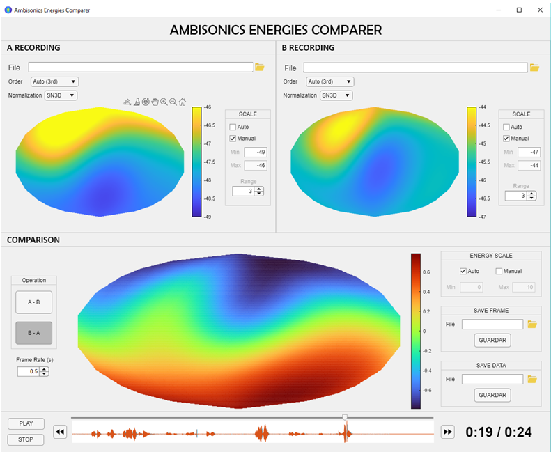

# AmbisonicsEnergiesComparer

Ambisonics Energies Comparer is a Matlab app to compare two different Ambisonics signals, up to seventh order, in a visual way. Both signals, loaded as wav files, will be drawn by their energy distribution in an azimuthal equal-area projection: the Hammer projection.

Versions for both, Matlab application (*.mlappinstall*) and desktop application (*.exe*) are provided.
